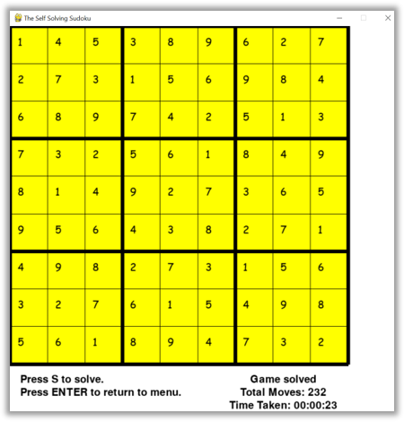

# Software Test report  

## Menu Button interface testing

*To Ensure the button interface alignment display correctly and button work as intended*

*(Date Conducted: 30/7/2022 Software Version 1.1)*

*Performed on device: HP & Razer*

*Performed on OS: Windows 10, Windows 11*

*Performed on source-code editor: VSC, Spyders*

*Error or Bugs: None*

*Remarks: Code works as intended.*

## Sudoku Solver testing

*Test carry out to ensure the sudoku solver logics works for each difficulty*

*(Date Conducted: 30/7/2022 Software Version 1.1)*

*Performed on device: HP, Razer*

*Performed on OS: Windows 10, Windows 11*

*Performed on source-code editor: VSC, Spyders*

*Error or Bugs: None*

*Time taken to solve easy difficulty:Approximately 5 seconds*

*Time taken to solve Medium difficulty:Approximately 1 minutes*

*Time taken to solve Hard difficulty:Approximately 60 minutes*

*Time taken to solve Hard difficulty:Approximately 120 minutes*

## Timer for difficulty analysis test

*To Ensure the timer begins upon start of while loop and stop upon solving the diffuclty, hence display time taken & plot on chart*

*(Date Conducted: 30/7/2022 Software Version 1.1)*

*Performed on device: HP & Razer*

*Performed on OS: Windows 10, Windows 11*

*Performed on source-code editor: VSC, Spyders*

*Error or Bugs: None*

*Remarks: Code works as intended.*

## Chart graphic for difficulty analysis test

*To ensure the result display correctly on the graph*

*(Date Conducted: 30/7/2022 Software Version 1.1)*

*Performed on device: HP & Razer*

*Performed on OS: Windows 10, Windows 11*

*Performed on source-code editor: VSC, Spyders*

*Error or Bugs: None*

*Remarks: Code works as intended.*

