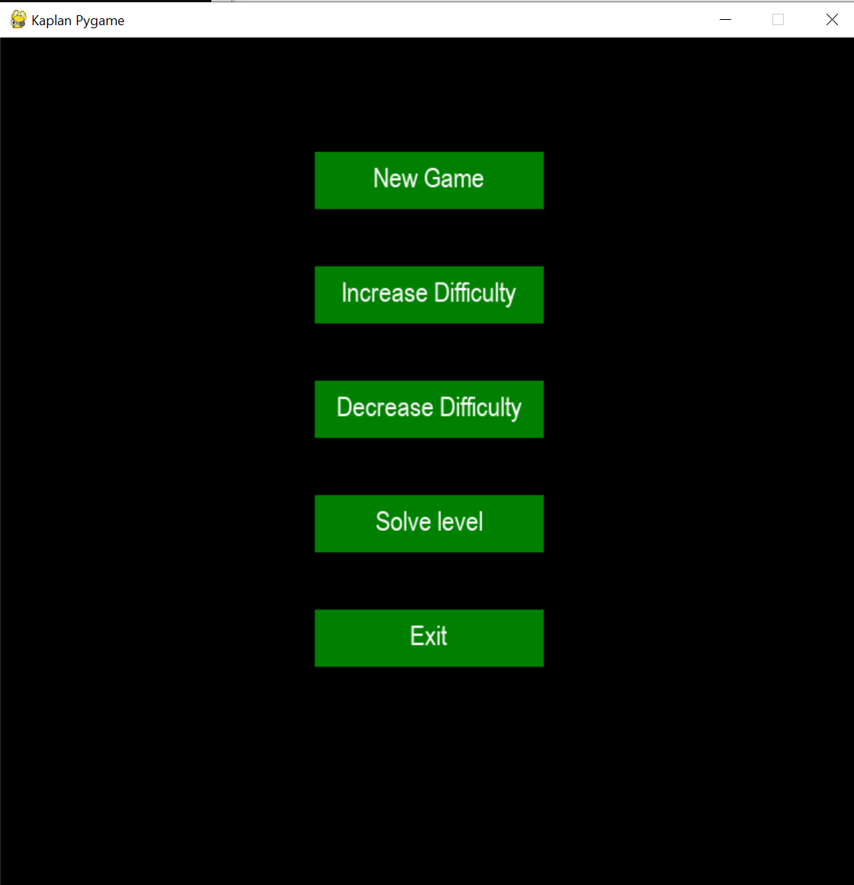

# Product Demonstration Report

In this MVP, we have built a functional Sudoku game that solves it self with a main menu. As you can see below, we have a functional 4 screens which allows you to navigate from Main Menu to the time the game is generated and solved.

## Consecutive Screenshots ##

Screen 1

Screen 2

Screen 3

Screen 4

## Proud Moments ##

We are extremely proud about the solver feature which uses a backtrack logic as it solves. It took us awhile with R&D to understand and come up with the logic for multi-complexity Sudoku.

## Incomplete items ##

In this MVP, we are missing of the following which will be implemented in the final product:

1. Increase/Decrease difficulty feature
2. Analysis generation feature